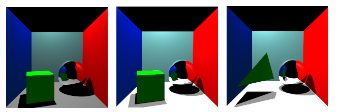

# Renderizacion c++ usando visual studio

Autor:william

El respositorio se destina a estudiar la teoria de renderizacion partiendo del uso de c++ y visual studio.

El repo contendra implementaciones de renderizacion por trazado de rayos y trazado de caminos.

Trazado de rayos:

<h3 align="center">
  
</h3>

Referencias:

[1] J. D. Foley, F. D. Van, A. Van Dam, S. K. Feiner, and J. F. Hughes, Computer
graphics: principles and practice, vol. 12110. Addison-Wesley Professional, 1996.
[2] P. Shirley, “Ray tracing in one weekend,” Amazon Digital Services LLC, vol. 1,
2016
