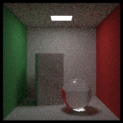

# Renderizacion c++ usando visual studio

Autor:william

El respositorio se destina a estudiar la teoria de renderizacion partiendo del uso de c++ y visual studio. El codigo en colab marca una guia base de como funciona la renderizacion usando trazado de rayos, en cuanto al codigo en c++ profundiza mucho mas en varios aspectos teoricos visto la literatura.

El repo contendra implementaciones de renderizacion por trazado de rayos y trazado de caminos.

Trazado de rayos:

Caracteristicas implementadas en c++:

- Escena creada con esferas, cajas y/o planos.
- Escena iluminada con 2 fuentes de luz puntual.
- Escena renderizada con iluminacion directa, usando el modelo Phong, con cálculo de sombras.
- Implementacion de antialias (supersampling).
- Instancia representada por triangulos.
- Calculo de la reflexión y refracción de la luz.

<h3 align="center">
  
</h3>

Trazado de caminos montecarlo:

Caracteristicas implementadas en c++:

- A cena deve ser criada com Instanciação de esferas, caixas e/ou planos.
- A cena deve ser iluminada por uma ou mais fontes de luz retangulares
- A cena deve conter objetos com materiais difusos (BRDF constante).
- A cena deve poder ser renderizada com múltiplos caminhos por pixel.
- Instancia representada por triangulos.
- Os caminhos devem ter profundidade mínima de 4 (isto é, o quarto vértice deve estar na
fonte de luz).

<h3 align="center">
  
</h3>

Referencias:

[1] J. D. Foley, F. D. Van, A. Van Dam, S. K. Feiner, and J. F. Hughes, Computer
graphics: principles and practice, vol. 12110. Addison-Wesley Professional, 1996.

[2] P. Shirley, “Ray tracing in one weekend,” Amazon Digital Services LLC, vol. 1,
2016

[2] P. Shirley, “Ray Tracing: The Rest of Your Life,” Amazon Digital Services LLC, vol. 1,
2018

